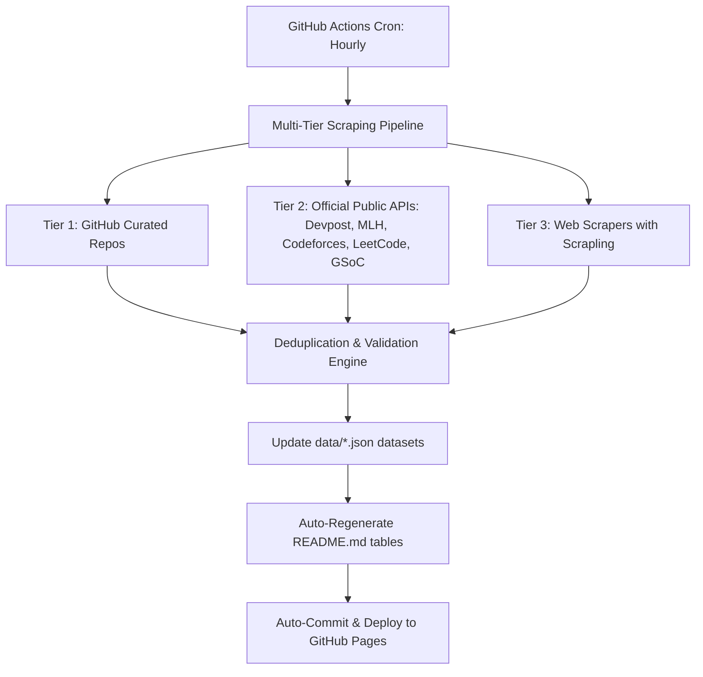

# 🚀 OpportunityHub — All Tech in One Place

### The Automated, Curated Hub for Hackathons, Internships, Competitions, Open Source & Fellowships

**Never miss an application deadline again.** A real-time, automated aggregation pipeline scraping top student directories, official APIs (Devpost, MLH, Codeforces, LeetCode, GSoC), and GitHub trackers hourly.

[🌐 **Browse Interactive Web App**](https://harir03.github.io/all-tech-inoneplace/) · [➕ **Submit Opportunity**](https://github.com/harir03/all-tech-inoneplace/issues/new?template=add-opportunity.yml) · [🐛 **Report Issue**](https://github.com/harir03/all-tech-inoneplace/issues/new?template=report-issue.yml)

---

## 📋 Table of Contents

- [🏆 Live Hackathons (101)](#-live-hackathons)
- [💼 Featured Tech Internships (1492)](#-featured-tech-internships)
- [⚔️ Live Competitions & Contests (8)](#️-live-competitions--contests)
- [🌍 Open Source Programs & Mentorships (117)](#-open-source-programs--mentorships)
- [🎓 Fellowships & Grants (8)](#-fellowships--grants)
- [🌐 Interactive Website & Filters](#-interactive-website--filters)
- [🤖 Automated Production Pipeline](#-automated-production-pipeline)
- [🤝 How to Contribute](#-how-to-contribute)
- [📜 License](#-license)

---

## 🏆 Live Hackathons

> Showing top active & upcoming hackathons. Browse all **101 hackathons** on the [🌐 Interactive Web App](https://harir03.github.io/all-tech-inoneplace/).

| Name | Organizer | Location / Mode | Prize / Fee | Timeline / Deadline | Status | Apply |
|:-----|:----------|:----------------|:------------|:--------------------|:------:|:-----:|
| **Smart India Hackathon (SIH) 2026** | Government of India / AICTE / MoE | Hybrid (Online Prelims + Onsite Grand Finale) | ₹1,00,000 per problem statement (Software); ₹1,00,000+ (Hardware) | 2026-09-30 | 🟢 Open | [Apply →](https://sih.gov.in) |
| **MLH Global Hack Week** | Major League Hacking (MLH) | Online | Varies per event — swag, prizes, and MLH points | Rolling (multiple events per year) | 🟢 Open | [Apply →](https://ghw.mlh.io) |
| **Devfolio Hackathons** | Devfolio (Various organizers) | Online / Offline / Hybrid | Varies — ₹10,000 to ₹10,00,000+ | Rolling (check platform) | 🟢 Open | [Apply →](https://devfolio.co/hackathons) |
| **Call for Code Global Challenge** | Global / Student | Online/Global | Prizes / Swag / Grants | Mar–Oct 2025 | 🟢 Open | [Apply →](https://callforcode.org/challenge/) |
| **Major League Hacking Events** | Global / Student | USA/Canada/Mexico | Prizes / Swag / Grants | Various 2025 | 🟢 Open | [Apply →](https://mlh.io/seasons/na-2025/events) |
| **GitLab Virtual Hackathon** | Global / Student | Online | Prizes / Swag / Grants | Apr 10–17, 2025 | 🟢 Open | [Apply →](https://about.gitlab.com/community/hackathon/) |
| **OpenHackathons (NVIDIA)** | Global / Student | Online | Prizes / Swag / Grants | Jun 24–Jul 3, 2025 | 🟢 Open | [Apply →](https://www.openhackathons.org/) |
| **Digital Jam Hackathon** | Global / Student | Online | Prizes / Swag / Grants | Mar 28, 2025 (Deadline) | 🟢 Open | [Apply →](https://www.digitaljamaica.com/digital-jam-hackathon-2025/) |
| **DeveloperWeek Hackathon** | Global / Student | Santa Clara, CA + Online | Prizes / Swag / Grants | Jan 27–Feb 13, 2025 | 🟢 Open | [Apply →](https://www.developerweek.com/hackathon/) |
| **nwHacks 2025** | Global / Student | Vancouver, Canada | Prizes / Swag / Grants | Jan 18–19, 2025 | 🟢 Open | [Apply →](https://nwhacks.io/) |
| **Hoya Hacks 2025** | Global / Student | Washington, D.C. | Prizes / Swag / Grants | Jan 24–26, 2025 | 🟢 Open | [Apply →](https://www.hoyahacks.com/) |
| **QHacks 2025** | Global / Student | Kingston, Canada | Prizes / Swag / Grants | Jan 24–26, 2025 | 🟢 Open | [Apply →](https://qhacks.io/) |
| **nf-core Hackathon** | Global / Student | Global (Online + Local) | Prizes / Swag / Grants | Mar 24–26, 2025 | 🟢 Open | [Apply →](https://nf-co.re/events/2025/hackathon-spring) |
| **WCRP KM-scale Hackathon** | Global / Student | Global | Prizes / Swag / Grants | May 12–16, 2025 | 🟢 Open | [Apply →](https://www.wcrp-climate.org/news/wcrp-news/2203-kmscale-hackathon-2025) |
| **NASA Space Apps Challenge** | Global / Student | Global | Prizes / Swag / Grants | Oct 4–5, 2025 | 🟢 Open | [Apply →](https://www.spaceappschallenge.org/) |

---

## 💼 Featured Tech Internships

> Showing sample openings. Browse all **1,492 internships & new grad positions** on the [🌐 Interactive Web App](https://harir03.github.io/all-tech-inoneplace/) with role, domain & location filters!

| Company & Role | Location | Level / Type | Compensation | Deadline | Status | Apply |
|:---------------|:---------|:-------------|:-------------|:---------|:------:|:-----:|
| **Mitacs Globalink Research Internship** | Various Canadian Universities | Undergraduate students from eligible countries including India (min. 2 semesters remaining) | CAD $6000 + Travel + Accommodation | 2026-09-15 | 🟢 Open | [Apply →](https://www.mitacs.ca/our-programs/globalink-research-internship-students/) |
| **ISRO Internship / Research Fellowship** | ISRO centres across India | B.E./B.Tech/M.Sc/M.Tech students (Indian nationals) | ₹10,000 - ₹25,000/month (varies by centre) | Rolling (check individual centres) | 🟢 Open | [Apply →](https://www.isro.gov.in/Internship.html) |
| **BTI360 — Software Engineer Intern** | Herndon, VA | Students / New Grads (check listing) | Competitive / Check listing | Apply ASAP (Rolling) | 🟢 Open | [Apply →](https://job-boards.greenhouse.io/bti36021/jobs/8155152?utm_source=Simplify&ref=Simplify) |
| **Springs Window Fashions — Software Engineering Intern - Summer 2027** | Long Island City, Queens, NY | Students / New Grads (check listing) | Competitive / Check listing | Apply ASAP (Rolling) | 🟢 Open | [Apply →](https://careers-springswindowfashions.icims.com/jobs/12891/job?mobile=true&needsRedirect=false&utm_source=Simplify&ref=Simplify) |
| **Sage — Software Engineer Intern - Edge - Summer 2027** | NYC | Students / New Grads (check listing) | Competitive / Check listing | Apply ASAP (Rolling) | 🟢 Open | [Apply →](https://job-boards.greenhouse.io/sage49/jobs/6131191004?utm_source=Simplify&ref=Simplify) |
| **↳ — Software Engineer Intern - Full Stack** | NYC | Students / New Grads (check listing) | Competitive / Check listing | Apply ASAP (Rolling) | 🟢 Open | [Apply →](https://job-boards.greenhouse.io/sage49/jobs/6131185004?utm_source=Simplify&ref=Simplify) |
| **Westinghouse Electric Company — Computer Engineering / Software Engineering Intern** | Cranberry Township, PA | Students / New Grads (check listing) | Competitive / Check listing | Apply ASAP (Rolling) | 🟢 Open | [Apply →](https://careers.westinghousenuclear.com/job/Cranberry-Township-Summer-Intern-Computer-Engineering-Software-Engineering-NC/1422595200/?ats=successfactors&utm_source=Simplify&ref=Simplify) |
| **Medpace — Python Intern - Summer 2027** | Cincinnati, OH | Students / New Grads (check listing) | Competitive / Check listing | Apply ASAP (Rolling) | 🟢 Open | [Apply →](https://careers.medpace.com/jobs/12962?icims=1&utm_source=Simplify&ref=Simplify) |
| **🔥 Google — Software Developer Intern 🎓** | Montreal, QC, CanadaToronto, ON, CanadaWaterloo, ON, Canada | Students / New Grads (check listing) | Competitive / Check listing | Apply ASAP (Rolling) | 🟢 Open | [Apply →](https://www.google.com/about/careers/applications/jobs/results/112518690523488966?utm_source=Simplify&ref=Simplify) |
| **BNY — Engineering Intern - Engineering - Developer** | Pittsburgh, PA | Students / New Grads (check listing) | Competitive / Check listing | Apply ASAP (Rolling) | 🟢 Open | [Apply →](https://eofe.fa.us2.oraclecloud.com/hcmUI/CandidateExperience/en/sites/CX_1001/job/81254?utm_source=Simplify&ref=Simplify) |
| **↳ — Engineering Intern - Developer** | Greater Manchester, UK | Students / New Grads (check listing) | Competitive / Check listing | Apply ASAP (Rolling) | 🟢 Open | [Apply →](https://eofe.fa.us2.oraclecloud.com/hcmUI/CandidateExperience/en/sites/CX_1001/job/81318?utm_source=Simplify&ref=Simplify) |
| **↳ — Engineering Developer Intern - Engineering** | Lake Mary, FL | Students / New Grads (check listing) | Competitive / Check listing | Apply ASAP (Rolling) | 🟢 Open | [Apply →](https://eofe.fa.us2.oraclecloud.com/hcmUI/CandidateExperience/en/sites/CX_1001/job/81252?utm_source=Simplify&ref=Simplify) |
| **↳ — Software Developer Intern - Engineering** | NYC | Students / New Grads (check listing) | Competitive / Check listing | Apply ASAP (Rolling) | 🟢 Open | [Apply →](https://eofe.fa.us2.oraclecloud.com/hcmUI/CandidateExperience/en/sites/CX_1001/job/81253?utm_source=Simplify&ref=Simplify) |
| **Gulfstream — Software Engineer Intern - IEF** | Savannah, GA | Students / New Grads (check listing) | Competitive / Check listing | Apply ASAP (Rolling) | 🟢 Open | [Apply →](https://careers.gulfstream.com/job/Savannah-Summer-2027-IEF-Software-Engineer-Collegiate-Associate-Intern-GA-31401/1421863200/?ats=successfactors&utm_source=Simplify&ref=Simplify) |
| **The Hartford — Software Engineer Intern - Tech & Data Program** | Hartford, CT | Students / New Grads (check listing) | Competitive / Check listing | Apply ASAP (Rolling) | 🟢 Open | [Apply →](https://thehartford.wd5.myworkdayjobs.com/Careers_External/job/Hartford-CT/Tech---Data-Program-Summer-2027---Software-Engineer-Intern--Hartford-_R2626105-1?utm_source=Simplify&ref=Simplify) |

---

## ⚔️ Live Competitions & Contests

> Real-time contests fetched directly from Codeforces, LeetCode, ACM-ICPC, and platforms.

| Contest / Challenge | Platform | Mode | Prizes / Rating | Event Date | Status | Register |
|:--------------------|:---------|:-----|:----------------|:-----------|:------:|:--------:|
| **Google Code Jam / Coding Competitions** | Google | Online | $15,000 grand prize + Google recognition | Various rounds throughout the year | 🟢 Open | [Register →](https://codingcompetitions.withgoogle.com) |
| **Unstop Competitions** | Unstop (Various organizers) | Online / Offline | Varies — ₹5,000 to ₹50,00,000+ | Various | 🟢 Open | [Register →](https://unstop.com/competitions) |
| **Codeforces Competitive Programming Rounds** | Codeforces / Mike Mirzayanov | Online | Rating changes + occasional prize money in Global Rounds | Weekly contests | 🟢 Open | [Register →](https://codeforces.com/contests) |
| **Accenture Innovation Challenge** | Global Competition Organizers | Online & Onsite | Awards / Cash / Recognition | Check competition portal | 🟢 Open | [Register →](https://unstop.com) |
| **Codeforces Round (Div. 2)** | Codeforces | Online | Rating change + prizes for top performers | 2026-08-29 14:35 UTC | 🟢 Open | [Register →](https://codeforces.com/contest/2258) |
| **Biweekly Contest 190** | LeetCode | Online | Rating change + badges | 2026-08-29 14:30 UTC | 🟢 Open | [Register →](https://leetcode.com/contest/biweekly-contest-190/) |
| **Weekly Contest 517** | LeetCode | Online | Rating change + badges | 2026-08-30 02:30 UTC | 🟢 Open | [Register →](https://leetcode.com/contest/weekly-contest-517/) |
| **ICPC (International Collegiate Programming Contest)** | ICPC Foundation / Baylor University | Onsite (Regionals) + Onsite (World Finals) | Trophies, medals, scholarships, and global recognition | Regionals: Nov-Dec 2026, World Finals: 2027 | 🟡 Soon | [Register →](https://icpc.global) |

---

## 🌍 Open Source Programs & Mentorships

> Mentorship programs offering stipends, contributor tracks, and real-world OSS experience.

| Program | Organization | Stipend / Grant | Duration | Timeline / Deadline | Status | Apply |
|:--------|:-------------|:----------------|:---------|:--------------------|:------:|:-----:|
| **LFX Mentorship (Linux Foundation)** | The Linux Foundation | $3000 - $6600 per term | 12 weeks per term | Rolling (per term) | 🟢 Open | [Apply →](https://mentorship.lfx.linuxfoundation.org) |
| **MLH Fellowship** | Via Deepanshu-OSPrograms | Yes | 10-12 weeks | Spring, Summer, Fall batches | 🟢 Open | [Apply →](https://fellowship.mlh.io/) |
| **LFX Mentorship** | Via Deepanshu-OSPrograms | Yes | 10-12 weeks | Multiple batches | 🟢 Open | [Apply →](https://lfx.linuxfoundation.org/tools/mentorship/) |
| **Summer of Bitcoin** | Via Deepanshu-OSPrograms | Yes | 10-12 weeks | Summer months | 🟢 Open | [Apply →](https://www.summerofbitcoin.org/) |
| **Hyperledger Mentorship Program** | Via Deepanshu-OSPrograms | Yes | 10-12 weeks | Multiple batches | 🟢 Open | [Apply →](https://wiki.hyperledger.org/display/INTERN/Hyperledger+Mentorship+Program) |
| **Open Mainframe Project Mentorship Program** | Via Deepanshu-OSPrograms | Yes | 10-12 weeks | Multiple batches | 🟢 Open | [Apply →](https://openmainframeproject.org/community/mentorship-program/) |
| **OSS World Challenge** | Via Deepanshu-OSPrograms | Cash prizes | 10-12 weeks | Annual | 🟢 Open | [Apply →](https://www.oss.kr/en_oss_world_challenage) |
| **Igalia Coding Experience Program** | Via Deepanshu-OSPrograms | Yes | 10-12 weeks | Summer | 🟢 Open | [Apply →](https://www.igalia.com/coding-experience/) |
| **Hacktoberfest** | Via Deepanshu-OSPrograms | Swag | 10-12 weeks | October annually | 🟢 Open | [Apply →](https://hacktoberfest.digitalocean.com/) |
| **Apertre 2.0** | Via Deepanshu-OSPrograms | PrizePool Worth of 20K (Including Swags) | 10-12 weeks | March 7 to April 5 (2025) | 🟢 Open | [Apply →](https://s2apertre.resourcio.in/) |
| **24 Pull Requests** | Via Deepanshu-OSPrograms | No prizes | 10-12 weeks | December annually | 🟢 Open | [Apply →](https://24pullrequests.com/) |
| **Advent of Code** | Via Deepanshu-OSPrograms | Learning | 10-12 weeks | December annually | 🟢 Open | [Apply →](https://adventofcode.com/) |
| **CodeForces** | Via Deepanshu-OSPrograms | Ratings, prizes | 10-12 weeks | Year-round | 🟢 Open | [Apply →](https://codeforces.com/) |
| **Facebook Hacker Cup** | Via Deepanshu-OSPrograms | Cash prizes | 10-12 weeks | Annual | 🟢 Open | [Apply →](https://www.facebook.com/codingcompetitions/hacker-cup/) |
| **ACM ICPC** | Via Deepanshu-OSPrograms | Medals, prizes | 10-12 weeks | Annual | 🟢 Open | [Apply →](https://icpc.global/) |

---

## 🎓 Fellowships & Grants

| Fellowship Name | Organization | Focus / Eligibility | Stipend & Benefits | Timeline | Status | Apply |
|:----------------|:-------------|:--------------------|:-------------------|:---------|:------:|:-----:|
| **MLH Fellowship** | Major League Hacking (MLH) | Students & recent grads (18+, global) | $5000 for 12 weeks | Rolling (per batch) | 🟢 Open | [Apply →](https://fellowship.mlh.io) |
| **University Innovation Fellowship - Stanford University** | Student / Research Organization | Students / Graduates (check program details) | Stipend / Mentorship provided | Annual / Check portal | 🟢 Open | [Apply →](http://universityinnovationfellows.org/) |
| **Teach for India Fellowship** | Student / Research Organization | Students / Graduates (check program details) | Stipend / Mentorship provided | Annual / Check portal | 🟢 Open | [Apply →](https://apply.teachforindia.org/) |
| **Young India Fellowship** | Student / Research Organization | Students / Graduates (check program details) | Stipend / Mentorship provided | Annual / Check portal | 🟢 Open | [Apply →](https://github.com) |
| **Urban Leaders Fellowship** | Student / Research Organization | Students / Graduates (check program details) | Stipend / Mentorship provided | Annual / Check portal | 🟢 Open | [Apply →](http://www.urbanleadersfellowship.org/) |
| **Legislative Assistants to Members of Parliament (LAMP) Fellowship** | Student / Research Organization | Students / Graduates (check program details) | Stipend / Mentorship provided | Annual / Check portal | 🟢 Open | [Apply →](http://lamp.prsindia.org/thefellowship) |
| **GitHub Externship (India)** | GitHub | Indian university students (B.E./B.Tech, pre-final year preferred) | Stipend provided | Check GitHub India careers page | 🟡 Soon | [Apply →](https://externships.github.com) |
| **FOSSEE Summer Fellowship (IIT Bombay)** | IIT Bombay / FOSSEE Project | Indian students (B.E./B.Tech/M.Sc/MCA, any year) | ₹5,000 - ₹10,000/month + Certificate from IIT Bombay | 2026-04-15 | 🔴 Closed | [Apply →](https://fossee.in/fellowship) |

---

## 🌐 Interactive Website & Filters

OpportunityHub comes with a companion web app offering:
- **💻 Role & Domain Filters**: Software Engineering, AI/ML, Data Science, Cloud/DevOps, Security, Mobile, Hardware/FPGA, Quant, Product.
- **📍 Location Filters**: Remote (WFH), India (Bangalore, NCR, Pune, Hyd), US, Canada, Europe, Global.
- **⚡ 1-Click Quick Apply**: Store your profile locally in your browser and autofill applications with 1 click.
- **🔔 Deadline Reminders**: Get notified before deadlines close.

👉 **Launch the Web App:** [**https://harir03.github.io/all-tech-inoneplace/**](https://harir03.github.io/all-tech-inoneplace/)

---

## 🤖 Automated Production Pipeline

OpportunityHub is powered by a GitHub Actions automation engine that runs **every hour**:

---

## 🤝 How to Contribute

We love community contributions!
- ➕ **[Submit an Opportunity](https://github.com/harir03/all-tech-inoneplace/issues/new?template=add-opportunity.yml)** via our structured form.
- 🐛 **[Report Dead Links or Outdated Info](https://github.com/harir03/all-tech-inoneplace/issues/new?template=report-issue.yml)**.
- 💻 **Open a PR**: Edit `data/*.json` directly and submit a Pull Request.

---

## 📜 License

Distributed under the [MIT License](LICENSE). Data aggregated from open-source community trackers and public APIs.
