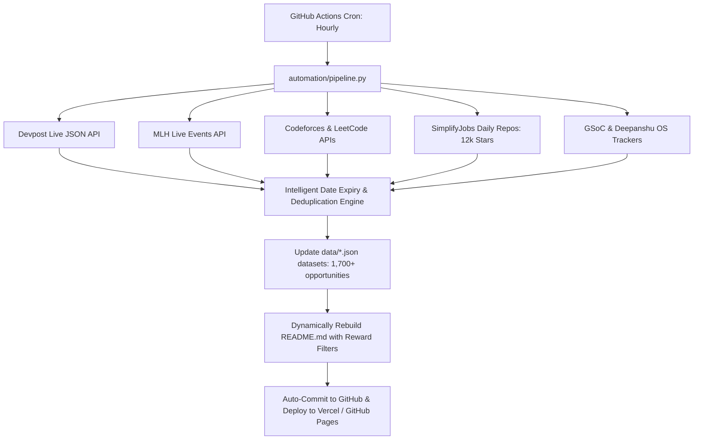

# 🚀 OpportunityHub — All Tech in One Place

### The Automated, Curated Hub for Hackathons, Internships, Competitions, Open Source & Fellowships

**Never miss an application deadline again.** A real-time, automated aggregation pipeline scraping top student directories, official APIs (Devpost, MLH, Codeforces, LeetCode, GSoC), and GitHub trackers hourly.

[🌐 **Browse Interactive Web App**](https://harir03.github.io/all-tech-inoneplace/) · [➕ **Submit Opportunity**](https://github.com/harir03/all-tech-inoneplace/issues/new?template=add-opportunity.yml) · [🐛 **Report Issue**](https://github.com/harir03/all-tech-inoneplace/issues/new?template=report-issue.yml)

---

## 🎯 Quick Jump: Browse by Reward & Prize Type

| 💰 [Mega Cash Prizes](#-top-mega-cash-prizes) | 💼 [Job & Internship Tracks](#-direct-internship--job-referral-tracks) | 🌍 [Paid OS Stipends](#-stipend-backed-open-source-mentorships) | 🎁 [Swag, Goodies & Free GPU Credits](#-swag-goodies-hardware-labs--cloud-credits) |
|:---:|:---:|:---:|:---:|

---

## 💰 Top Mega Cash Prizes ($10,000 to $740,000+ / ₹1,00,000+)

> Live hackathons and coding competitions offering major cash prize pools and bounties.

| Event Name | Type | Prize Pool / Rewards | Mode / Location | Deadline | Apply |
|:-----------|:-----|:---------------------|:----------------|:---------|:-----:|
| **Devfolio Hackathons** | ⚔️ Contest | **Varies — ₹10,000 to ₹10,00,000+** | Online / Offline / Hybrid | Rolling (check platform) | [Apply →](https://devfolio.co/hackathons) |
| **RevenueCat Shipaton 2026** | 🏆 Hackathon | **$740,000** | Online | Jul 31 - Oct 01, 2026 | [Apply →](https://revenuecat-shipaton-2026.devpost.com/) |
| **Agentic Cinema: The Blockbuster Hackathon** | 🏆 Hackathon | **$75,000** | Online | Jul 27 - Sep 09, 2026 | [Apply →](https://agentic-cinema.devpost.com/) |
| **All Things Agentic Hackathon** | 🏆 Hackathon | **$180,000** | Online | Aug 04 - 31, 2026 | [Apply →](https://allthingsagentichackathon.devpost.com/) |
| **Agents for Humans Hackathon** | 🏆 Hackathon | **$40,000** | Online | Aug 10 - Sep 14, 2026 | [Apply →](https://agentsforhumans.devpost.com/) |
| **CALL-E: Your Code Is Calling** | 🏆 Hackathon | **$10,000** | Online | Jul 23 - Sep 14, 2026 | [Apply →](https://call-e.devpost.com/) |
| **AI Builders Hackathon** | 🏆 Hackathon | **$33,900** | Online | Aug 21 - Sep 15, 2026 | [Apply →](https://ai-builders-hackathon-2026.devpost.com/) |
| **VoltHacks** | 🏆 Hackathon | **$35,785** | Online | May 22 - Sep 05, 2026 | [Apply →](https://volthacks.devpost.com/) |
| **3D Websites Hackathon** | 🏆 Hackathon | **$55** | Online | Jun 22 - Aug 31, 2026 | [Apply →](https://3d-websites-hackathon.devpost.com/) |
| **Hack for Humanity - Summer 2026 (+13 non-cash prizes)** | 🏆 Hackathon | **$100** | Online | Aug 07 - Sep 04, 2026 | [Apply →](https://hack-for-humanity-summer-26.devpost.com/) |

---

## 💼 Direct Internship & Job Referral Tracks

> Featured technical roles offering full-time internships, co-ops, and Pre-Placement Offers (PPOs).

| Company & Role | Location | Career Level | Compensation | Application Link |
|:---------------|:---------|:-------------|:-------------|:----------------:|
| **ISRO Internship / Research Fellowship** | ISRO centres across India | B.E./B.Tech/M.Sc/M.Tech students (Indian nationals) | ₹10,000 - ₹25,000/month (varies by centre) | [Apply Now →](https://www.isro.gov.in/Internship.html) |
| **Springs Window Fashions — Software Engineering Intern - Summer 2027** | Long Island City, Queens, NY | Students / New Grads (check listing) | Competitive / Check listing | [Apply Now →](https://careers-springswindowfashions.icims.com/jobs/12891/job?mobile=true&needsRedirect=false&utm_source=Simplify&ref=Simplify) |
| **Sage — Software Engineer Intern - Edge - Summer 2027** | NYC | Students / New Grads (check listing) | Competitive / Check listing | [Apply Now →](https://job-boards.greenhouse.io/sage49/jobs/6131191004?utm_source=Simplify&ref=Simplify) |
| **Westinghouse Electric Company — Computer Engineering / Software Engineering Intern** | Cranberry Township, PA | Students / New Grads (check listing) | Competitive / Check listing | [Apply Now →](https://careers.westinghousenuclear.com/job/Cranberry-Township-Summer-Intern-Computer-Engineering-Software-Engineering-NC/1422595200/?ats=successfactors&utm_source=Simplify&ref=Simplify) |
| **🔥 Google — Software Developer Intern 🎓** | Montreal, QC, CanadaToronto, ON, CanadaWaterloo, ON, Canada | Students / New Grads (check listing) | Competitive / Check listing | [Apply Now →](https://www.google.com/about/careers/applications/jobs/results/112518690523488966?utm_source=Simplify&ref=Simplify) |
| **BNY — Engineering Intern - Engineering - Developer** | Pittsburgh, PA | Students / New Grads (check listing) | Competitive / Check listing | [Apply Now →](https://eofe.fa.us2.oraclecloud.com/hcmUI/CandidateExperience/en/sites/CX_1001/job/81254?utm_source=Simplify&ref=Simplify) |
| **Springs Window Fashions — Application Engineering Intern - Summer 2027** | Long Island City, Queens, NY | Students / New Grads (check listing) | Competitive / Check listing | [Apply Now →](https://careers-springswindowfashions.icims.com/jobs/12893/job?mobile=true&needsRedirect=false&utm_source=Simplify&ref=Simplify) |
| **🔥 AMD — Software Engineer Intern/Co-op - Masters 🎓** | San Jose, CASanta Clara, CA | Students / New Grads (check listing) | Competitive / Check listing | [Apply Now →](https://careers.amd.com/jobs/91176?icims=1&utm_source=Simplify&ref=Simplify) |
| **BNY — Product Management Intern - Product Management** | NYC | Students / New Grads (check listing) | Competitive / Check listing | [Apply Now →](https://eofe.fa.us2.oraclecloud.com/hcmUI/CandidateExperience/en/sites/CX_1001/job/81345?utm_source=Simplify&ref=Simplify) |
| **Springs Window Fashions — Product Management Dashboard Analytics Intern** | Middleton, WI | Students / New Grads (check listing) | Competitive / Check listing | [Apply Now →](https://careers-springswindowfashions.icims.com/jobs/12882/job?mobile=true&needsRedirect=false&utm_source=Simplify&ref=Simplify) |

---

## 🌍 Stipend-Backed Open Source Mentorships ($1,500 – $7,000)

> Prestigious open source programs where contributors get paired with senior mentors and receive milestone stipends.

| Program Name | Organization | Stipend & Benefits | Duration | Eligibility | Apply |
|:-------------|:-------------|:-------------------|:---------|:------------|:-----:|
| **LFX Mentorship (Linux Foundation)** | The Linux Foundation | **$3000 - $6600 per term** | 12 weeks per term | Students & early-career developers (global) | [Apply →](https://mentorship.lfx.linuxfoundation.org) |
| **Outreachy** | Software Freedom Conservancy | **$7000 for 3 months** | 13 weeks | People underrepresented in tech (global, eligibility criteria apply) | [Apply →](https://www.outreachy.org) |
| **FOSSEE Summer Fellowship** | Via Deepanshu-OSPrograms | **Stipend** | 10-12 weeks | Open to all | [Apply →](https://fossee.in/) |
| **IIT Bombay Summer Internship** | Via Deepanshu-OSPrograms | **Stipend** | 10-12 weeks | Open to all | [Apply →](https://www.it.iitb.ac.in/summerinternship2020/) |
| **FOSS Overflow, IIT Bhilai** | Via Deepanshu-OSPrograms | **Stipend** | 10-12 weeks | Open to all | [Apply →](https://fossoverflow.dev/) |
| **Python Software Foundation Fellowship Program** | Via Deepanshu-OSPrograms | **Grants** | 10-12 weeks | Open to all | [Apply →](https://www.python.org/psf/grants/) |
| **The Processing Foundation Fellowships** | Via Deepanshu-OSPrograms | **Stipend** | 10-12 weeks | Open to all | [Apply →](https://processingfoundation.org/fellowships) |
| **GitHub Accelerator** | Student / Research Organization | **Stipend / Mentorship provided** | 10-12 weeks | Students / Graduates (check program details) | [Apply →](https://accelerator.github.com/) |
| **Community Contributor Group** | Student / Research Organization | **Stipend / Mentorship provided** | 10-12 weeks | Students / Graduates (check program details) | [Apply →](https://opencollective.com/community-contributor-group) |
| **Eddiehub** | Student / Research Organization | **Stipend / Mentorship provided** | 10-12 weeks | Students / Graduates (check program details) | [Apply →](https://www.eddiehub.org/) |

---

## 🎁 Swag, Goodies, Hardware Labs & Cloud Credits

> Free student benefits, verified contributor swag boxes, hardware labs, and developer packs.

| Event / Initiative | Provider | Perks, Goodies & Free Credits | Access | Claim / Register |
|:-------------------|:---------|:------------------------------|:-------|:----------------:|
| **MLH Global Hack Week** | Major League Hacking (MLH) | 🎁 Free Official Swag Kits, T-Shirts, Stickers, Discord Badges & MLH Season Points | Online (Worldwide) | [Claim / Register →](https://ghw.mlh.io) |
| **Hacktoberfest** | DigitalOcean & Cloudflare | 🌳 Official Contributor Digital Badge, Swag Packs & Tree Planting in your name | Online | [Claim / Register →](https://hacktoberfest.com) |
| **NVIDIA OpenHackathons** | NVIDIA / OpenACC | ⚡ Free GPU Cluster Compute Access, Mentorship from NVIDIA AI Engineers, Certificate | Online / Hybrid | [Claim / Register →](https://www.openhackathons.org/) |
| **GitHub Student Developer Pack** | GitHub Education | 🎒 $200k+ in Free Cloud Credits (AWS, Azure, DigitalOcean), Domain names, GitHub Copilot | Online | [Claim / Register →](https://education.github.com/pack) |
| **Midnight Virtual Hackathons** | Major League Hacking | 🛠️ Hardware Lab Access, API Credits, Swag, Resume Drop to Sponsors | Online | [Claim / Register →](https://events.mlh.com/) |

---

## 📋 Full Directory by Category

- [🏆 Live Hackathons (101)](#-live-hackathons)
- [💼 Tech Internships & New Grad (1492)](#-tech-internships--new-grad)
- [⚔️ Competitions & Contests (8)](#️-competitions--contests)
- [🌍 Open Source Programs (117)](#-open-source-programs)
- [🎓 Fellowships & Grants (8)](#-fellowships--grants)

---

## 🏆 Live Hackathons

> Showing featured active & upcoming hackathons. Browse all **101 hackathons** on the [🌐 Interactive Web App](https://harir03.github.io/all-tech-inoneplace/).

| Name | Organizer | Location / Mode | Prize / Fee | Timeline / Deadline | Status | Apply |
|:-----|:----------|:----------------|:------------|:--------------------|:------:|:-----:|
| **MLH Global Hack Week** | Major League Hacking (MLH) | Online | Varies per event — swag, prizes, and MLH points | Rolling (multiple events per year) | 🟢 Open | [Apply →](https://ghw.mlh.io) |
| **Devfolio Hackathons** | Devfolio (Various organizers) | Online / Offline / Hybrid | Varies — ₹10,000 to ₹10,00,000+ | Rolling (check platform) | 🟢 Open | [Apply →](https://devfolio.co/hackathons) |
| **Major League Hacking Events** | Global / Student | USA/Canada/Mexico | Prizes / Swag / Grants | Various 2025 | 🟢 Open | [Apply →](https://mlh.io/seasons/na-2025/events) |
| **Midnight Virtual Hackathon [August]** | Major League Hacking (MLH) | Online | Prizes, Swag, Hardware Labs, Mentorship | AUG 28 - 30 | 🟢 Open | [Apply →](https://events.mlh.com/events/14510-midnight-hackathon-august?utm_source=mlh&utm_medium=referral&utm_campaign=events&utm_content=Midnight+Virtual+Hackathon+%5BAugust%5D) |
| **PEC HACKS 4.0** | Major League Hacking (MLH) | In-Person | Prizes, Swag, Hardware Labs, Mentorship | AUG 29 - 30 | 🟢 Open | [Apply →](https://pechacks.org/?utm_source=mlh&utm_medium=referral&utm_campaign=events&utm_content=PEC+HACKS+4.0) |
| **HackNex Season 2** | Major League Hacking (MLH) | In-Person | Prizes, Swag, Hardware Labs, Mentorship | SEP 25 - 26 | 🟢 Open | [Apply →](https://innovocon.online/events/hacknex?utm_source=mlh&utm_medium=referral&utm_campaign=events&utm_content=HackNex+Season+2) |
| **HackGT 13** | Major League Hacking (MLH) | In-Person | Prizes, Swag, Hardware Labs, Mentorship | SEP 25 - 27 | 🟢 Open | [Apply →](http://hack.gt/?utm_source=mlh&utm_medium=referral&utm_campaign=events&utm_content=HackGT+13) |
| **ShellHacks** | Major League Hacking (MLH) | In-Person | Prizes, Swag, Hardware Labs, Mentorship | SEP 25 - 27 | 🟢 Open | [Apply →](https://shellhacks.net/?utm_source=mlh&utm_medium=referral&utm_campaign=events&utm_content=ShellHacks) |
| **DivHacks** | Major League Hacking (MLH) | In-Person | Prizes, Swag, Hardware Labs, Mentorship | SEP 26 - 27 | 🟢 Open | [Apply →](https://www.columbiadivhacks.org/?utm_source=mlh&utm_medium=referral&utm_campaign=events&utm_content=DivHacks) |
| **hackUMBC** | Major League Hacking (MLH) | In-Person | Prizes, Swag, Hardware Labs, Mentorship | SEP 26 - 27 | 🟢 Open | [Apply →](https://hackumbc.tech/?utm_source=mlh&utm_medium=referral&utm_campaign=events&utm_content=hackUMBC) |
| **OwlHacks** | Major League Hacking (MLH) | In-Person | Prizes, Swag, Hardware Labs, Mentorship | SEP 26 - 27 | 🟢 Open | [Apply →](https://www.owlhacks.com/?utm_source=mlh&utm_medium=referral&utm_campaign=events&utm_content=OwlHacks) |
| **hackCBS 9.O** | Major League Hacking (MLH) | In-Person | Prizes, Swag, Hardware Labs, Mentorship | OCT 31 - NOV 01 | 🟢 Open | [Apply →](https://hackcbs.tech/?utm_source=mlh&utm_medium=referral&utm_campaign=events&utm_content=hackCBS+9.O) |

---

## 💼 Tech Internships & New Grad

> Showing featured openings. Filter all **1,492 internships** by domain (AI/ML, SWE, Cloud, Security) on the [🌐 Interactive Web App](https://harir03.github.io/all-tech-inoneplace/).

| Company & Role | Location | Level / Type | Compensation | Deadline | Status | Apply |
|:---------------|:---------|:-------------|:-------------|:---------|:------:|:-----:|
| **ISRO Internship / Research Fellowship** | ISRO centres across India | B.E./B.Tech/M.Sc/M.Tech students (Indian nationals) | ₹10,000 - ₹25,000/month (varies by centre) | Rolling (check individual centres) | 🟢 Open | [Apply →](https://www.isro.gov.in/Internship.html) |
| **BTI360 — Software Engineer Intern** | Herndon, VA | Students / New Grads (check listing) | Competitive / Check listing | Apply ASAP (Rolling) | 🟢 Open | [Apply →](https://job-boards.greenhouse.io/bti36021/jobs/8155152?utm_source=Simplify&ref=Simplify) |
| **Springs Window Fashions — Software Engineering Intern - Summer 2027** | Long Island City, Queens, NY | Students / New Grads (check listing) | Competitive / Check listing | Apply ASAP (Rolling) | 🟢 Open | [Apply →](https://careers-springswindowfashions.icims.com/jobs/12891/job?mobile=true&needsRedirect=false&utm_source=Simplify&ref=Simplify) |
| **Sage — Software Engineer Intern - Edge - Summer 2027** | NYC | Students / New Grads (check listing) | Competitive / Check listing | Apply ASAP (Rolling) | 🟢 Open | [Apply →](https://job-boards.greenhouse.io/sage49/jobs/6131191004?utm_source=Simplify&ref=Simplify) |
| **↳ — Software Engineer Intern - Full Stack** | NYC | Students / New Grads (check listing) | Competitive / Check listing | Apply ASAP (Rolling) | 🟢 Open | [Apply →](https://job-boards.greenhouse.io/sage49/jobs/6131185004?utm_source=Simplify&ref=Simplify) |
| **Westinghouse Electric Company — Computer Engineering / Software Engineering Intern** | Cranberry Township, PA | Students / New Grads (check listing) | Competitive / Check listing | Apply ASAP (Rolling) | 🟢 Open | [Apply →](https://careers.westinghousenuclear.com/job/Cranberry-Township-Summer-Intern-Computer-Engineering-Software-Engineering-NC/1422595200/?ats=successfactors&utm_source=Simplify&ref=Simplify) |
| **Medpace — Python Intern - Summer 2027** | Cincinnati, OH | Students / New Grads (check listing) | Competitive / Check listing | Apply ASAP (Rolling) | 🟢 Open | [Apply →](https://careers.medpace.com/jobs/12962?icims=1&utm_source=Simplify&ref=Simplify) |
| **🔥 Google — Software Developer Intern 🎓** | Montreal, QC, CanadaToronto, ON, CanadaWaterloo, ON, Canada | Students / New Grads (check listing) | Competitive / Check listing | Apply ASAP (Rolling) | 🟢 Open | [Apply →](https://www.google.com/about/careers/applications/jobs/results/112518690523488966?utm_source=Simplify&ref=Simplify) |
| **BNY — Engineering Intern - Engineering - Developer** | Pittsburgh, PA | Students / New Grads (check listing) | Competitive / Check listing | Apply ASAP (Rolling) | 🟢 Open | [Apply →](https://eofe.fa.us2.oraclecloud.com/hcmUI/CandidateExperience/en/sites/CX_1001/job/81254?utm_source=Simplify&ref=Simplify) |
| **↳ — Engineering Intern - Developer** | Greater Manchester, UK | Students / New Grads (check listing) | Competitive / Check listing | Apply ASAP (Rolling) | 🟢 Open | [Apply →](https://eofe.fa.us2.oraclecloud.com/hcmUI/CandidateExperience/en/sites/CX_1001/job/81318?utm_source=Simplify&ref=Simplify) |
| **↳ — Engineering Developer Intern - Engineering** | Lake Mary, FL | Students / New Grads (check listing) | Competitive / Check listing | Apply ASAP (Rolling) | 🟢 Open | [Apply →](https://eofe.fa.us2.oraclecloud.com/hcmUI/CandidateExperience/en/sites/CX_1001/job/81252?utm_source=Simplify&ref=Simplify) |
| **↳ — Software Developer Intern - Engineering** | NYC | Students / New Grads (check listing) | Competitive / Check listing | Apply ASAP (Rolling) | 🟢 Open | [Apply →](https://eofe.fa.us2.oraclecloud.com/hcmUI/CandidateExperience/en/sites/CX_1001/job/81253?utm_source=Simplify&ref=Simplify) |

---

## ⚔️ Competitions & Contests

> Real-time contests from Codeforces, LeetCode, ICPC, and competitive programming platforms.

| Contest / Challenge | Platform | Mode | Prizes / Rating | Event Date | Status | Register |
|:--------------------|:---------|:-----|:----------------|:-----------|:------:|:--------:|
| **Google Code Jam / Coding Competitions** | Google | Online | $15,000 grand prize + Google recognition | Various rounds throughout the year | 🟢 Open | [Register →](https://codingcompetitions.withgoogle.com) |
| **Unstop Competitions** | Unstop (Various organizers) | Online / Offline | Varies — ₹5,000 to ₹50,00,000+ | Various | 🟢 Open | [Register →](https://unstop.com/competitions) |
| **Codeforces Competitive Programming Rounds** | Codeforces / Mike Mirzayanov | Online | Rating changes + occasional prize money in Global Rounds | Weekly contests | 🟢 Open | [Register →](https://codeforces.com/contests) |
| **Codeforces Round (Div. 2)** | Codeforces | Online | Rating change + prizes for top performers | 2026-08-29 14:35 UTC | 🟢 Open | [Register →](https://codeforces.com/contest/2258) |
| **Biweekly Contest 190** | LeetCode | Online | Rating change + badges | 2026-08-29 14:30 UTC | 🟢 Open | [Register →](https://leetcode.com/contest/biweekly-contest-190/) |
| **Weekly Contest 517** | LeetCode | Online | Rating change + badges | 2026-08-30 02:30 UTC | 🟢 Open | [Register →](https://leetcode.com/contest/weekly-contest-517/) |

---

## 🌍 Open Source Programs

| Program | Organization | Stipend / Grant | Duration | Timeline / Deadline | Status | Apply |
|:--------|:-------------|:----------------|:---------|:--------------------|:------:|:-----:|
| **LFX Mentorship (Linux Foundation)** | The Linux Foundation | $3000 - $6600 per term | 12 weeks per term | Rolling (per term) | 🟢 Open | [Apply →](https://mentorship.lfx.linuxfoundation.org) |
| **Outreachy** | Software Freedom Conservancy | $7000 for 3 months | 13 weeks | Varies per cohort (typically Feb & Aug) | 🟡 Soon | [Apply →](https://www.outreachy.org) |
| **MLH Fellowship** | Via Deepanshu-OSPrograms | Yes | 10-12 weeks | Spring, Summer, Fall batches | 🟢 Open | [Apply →](https://fellowship.mlh.io/) |
| **LFX Mentorship** | Via Deepanshu-OSPrograms | Yes | 10-12 weeks | Multiple batches | 🟢 Open | [Apply →](https://lfx.linuxfoundation.org/tools/mentorship/) |
| **Summer of Bitcoin** | Via Deepanshu-OSPrograms | Yes | 10-12 weeks | Summer months | 🟢 Open | [Apply →](https://www.summerofbitcoin.org/) |
| **Hyperledger Mentorship Program** | Via Deepanshu-OSPrograms | Yes | 10-12 weeks | Multiple batches | 🟢 Open | [Apply →](https://wiki.hyperledger.org/display/INTERN/Hyperledger+Mentorship+Program) |
| **Open Mainframe Project Mentorship Program** | Via Deepanshu-OSPrograms | Yes | 10-12 weeks | Multiple batches | 🟢 Open | [Apply →](https://openmainframeproject.org/community/mentorship-program/) |
| **OSS World Challenge** | Via Deepanshu-OSPrograms | Cash prizes | 10-12 weeks | Annual | 🟢 Open | [Apply →](https://www.oss.kr/en_oss_world_challenage) |
| **Igalia Coding Experience Program** | Via Deepanshu-OSPrograms | Yes | 10-12 weeks | Summer | 🟢 Open | [Apply →](https://www.igalia.com/coding-experience/) |
| **Hacktoberfest** | Via Deepanshu-OSPrograms | Swag | 10-12 weeks | October annually | 🟢 Open | [Apply →](https://hacktoberfest.digitalocean.com/) |
| **24 Pull Requests** | Via Deepanshu-OSPrograms | No prizes | 10-12 weeks | December annually | 🟢 Open | [Apply →](https://24pullrequests.com/) |
| **Advent of Code** | Via Deepanshu-OSPrograms | Learning | 10-12 weeks | December annually | 🟢 Open | [Apply →](https://adventofcode.com/) |

---

## 🎓 Fellowships & Grants

| Fellowship Name | Organization | Focus / Eligibility | Stipend & Benefits | Timeline | Status | Apply |
|:----------------|:-------------|:--------------------|:-------------------|:---------|:------:|:-----:|
| **MLH Fellowship** | Major League Hacking (MLH) | Students & recent grads (18+, global) | $5000 for 12 weeks | Rolling (per batch) | 🟢 Open | [Apply →](https://fellowship.mlh.io) |
| **GitHub Externship (India)** | GitHub | Indian university students (B.E./B.Tech, pre-final year preferred) | Stipend provided | Check GitHub India careers page | 🟡 Soon | [Apply →](https://externships.github.com) |
| **University Innovation Fellowship - Stanford University** | Student / Research Organization | Students / Graduates (check program details) | Stipend / Mentorship provided | Annual / Check portal | 🟢 Open | [Apply →](http://universityinnovationfellows.org/) |
| **Teach for India Fellowship** | Student / Research Organization | Students / Graduates (check program details) | Stipend / Mentorship provided | Annual / Check portal | 🟢 Open | [Apply →](https://apply.teachforindia.org/) |
| **Young India Fellowship** | Student / Research Organization | Students / Graduates (check program details) | Stipend / Mentorship provided | Annual / Check portal | 🟢 Open | [Apply →](https://github.com) |
| **Urban Leaders Fellowship** | Student / Research Organization | Students / Graduates (check program details) | Stipend / Mentorship provided | Annual / Check portal | 🟢 Open | [Apply →](http://www.urbanleadersfellowship.org/) |
| **Legislative Assistants to Members of Parliament (LAMP) Fellowship** | Student / Research Organization | Students / Graduates (check program details) | Stipend / Mentorship provided | Annual / Check portal | 🟢 Open | [Apply →](http://lamp.prsindia.org/thefellowship) |

---

## 🌐 Deploy to Vercel (1-Click Deployment)

You can host this entire platform on Vercel with zero configuration:

### Manual Vercel Deployment:
1. Import `harir03/all-tech-inoneplace` in your [Vercel Dashboard](https://vercel.com/new).
2. Framework Preset: **Other** (Root directory: `./`).
3. Click **Deploy** — [`vercel.json`](vercel.json) will automatically handle clean routing and `/data/` endpoints!

---

## 🤖 Automated Hourly Pipeline Architecture

---

## 🤝 How to Contribute

- ➕ **[Submit an Opportunity](https://github.com/harir03/all-tech-inoneplace/issues/new?template=add-opportunity.yml)** via our issue form.
- 🐛 **[Report Outdated Info / Dead Links](https://github.com/harir03/all-tech-inoneplace/issues/new?template=report-issue.yml)**.
- 💻 **Open a Pull Request**: Edit `data/*.json` directly.

---

## 📜 License

Distributed under the [MIT License](LICENSE).
